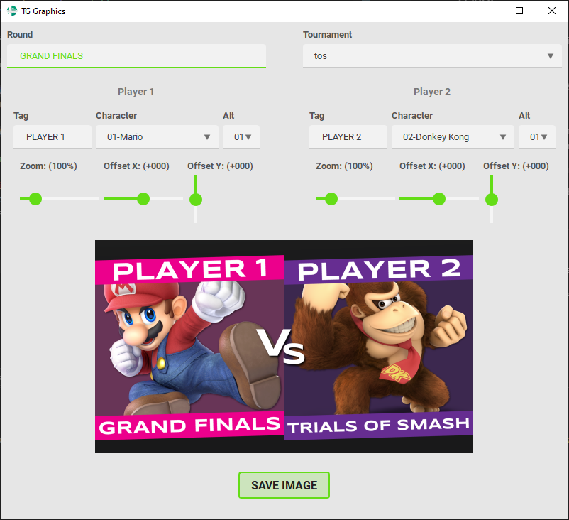
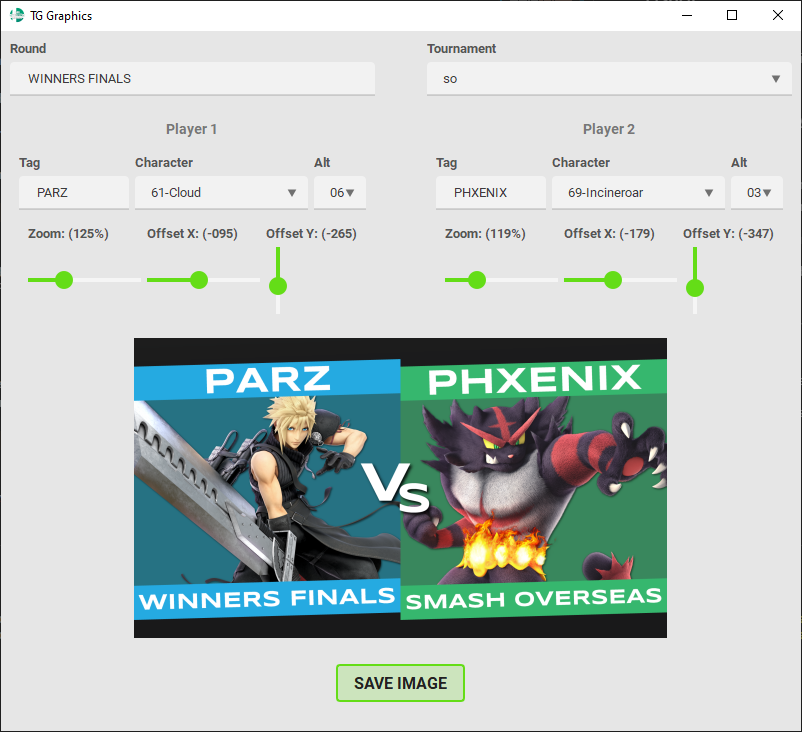
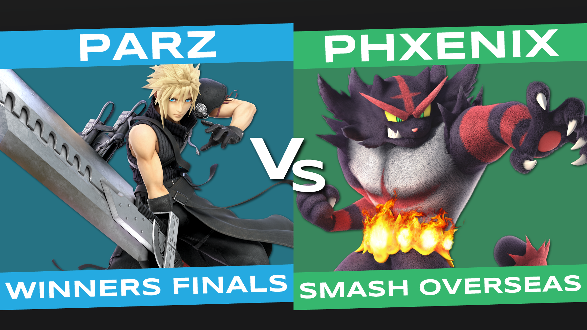

# GraphicAssembler

This is a simple to use tool to create Graphics for the Tournaments of the [SSBU Training Grounds Discord Server](https://discord.gg/ssbutg).

## Installation

1. [Install Python 3.9 or higher](https://www.python.org/downloads/)
2. [Download the Character Renders from the TrainingGrounds-Graphics repository](https://github.com/SSBUTrainingGrounds/TrainingGrounds-Graphics/tree/Character-Renders) and save them somewhere on your computer
3. [Download the latest release of this tool](https://github.com/SSBUTrainingGrounds/GraphicAssembler/releases)
4. Extract the downloaded zip file
5. Open a command prompt in the extracted folder and install the required packages by running `pip install -r requirements.txt`
6. Rename `config.example.json` to `config.json` and fill in the paths to the Character Renders and a folder to save the output to
7. Run `python main.py`

## Usage

### Top 8 Graphics

Not supported yet, but will be added soon.

### Youtube Thumbnails

When you open the tool you should see a window like this:

Most of this is straight forward, first select the Tournament in the upper right dropdown menu, and type in the round of the match in the upper left, make sure to use all caps.

Then fill in the information of both players, their tags, again in all caps, and select their characters together with the alt they used.

Some characters will not be centered correctly by default, you can fix this by adjusting the `Zoom`, `Offset X` and `Offset Y` sliders. 

When you are done, click the `Save Image` button on the bottom to save the generated thumbnail to the folder you specified in the config file.

The resulting image looks like this:

## Contributing

Feel free to contribute to this project in any way, be it opening a pull request to add features or opening an issue if you encounter a bug.  
If you want to be more involved with the development process, ask the moderation team for access to the `#dev-team` channel on the [SSBU Training Grounds Discord Server](https://discord.gg/ssbutg).

## Packages used

- [Pillow](https://python-pillow.org/)
- [PyQt6](https://pypi.org/project/PyQt6/)